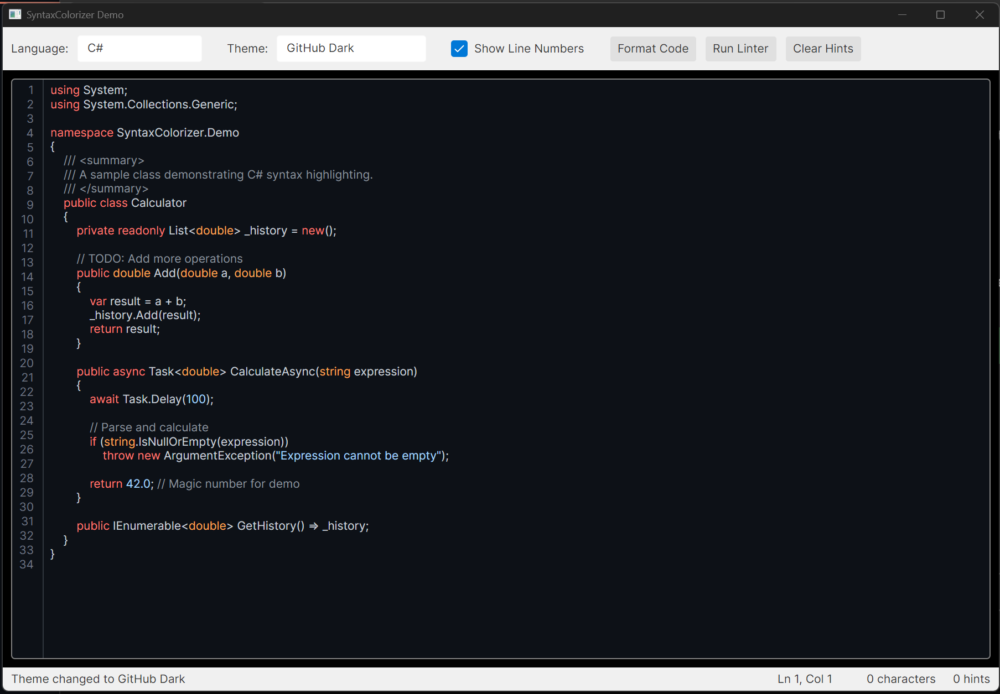
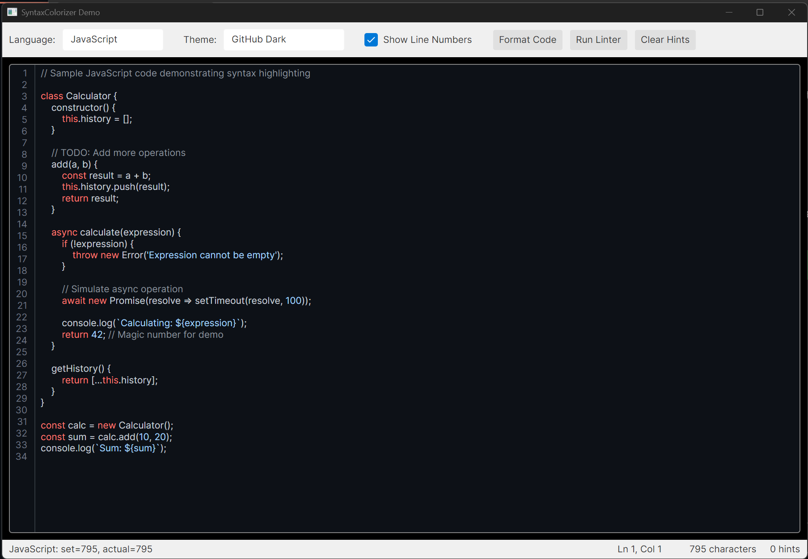
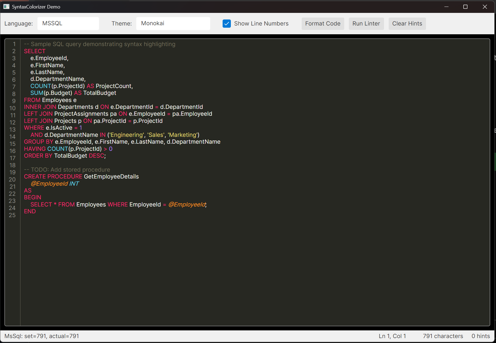
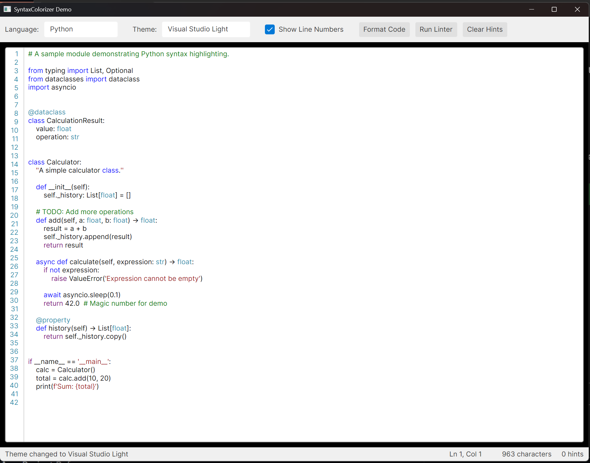

# SyntaxColorizer

A syntax-highlighting TextBox control for Avalonia with support for multiple programming languages. Built using only native Avalonia features without external dependencies.



<details>
<summary>More Screenshots</summary>





</details>

## Features

- Real-time syntax highlighting as you type
- Support for 26 programming languages
- 7 built-in color themes
- Line numbers display (toggleable)
- Linting infrastructure with customizable rules
- MVVM-friendly design
- NuGet package ready

## Supported Languages

| Category | Languages |
|----------|-----------|
| **C-Family** | C, C++, C#, Java, Kotlin, Scala, Swift |
| **Scripting** | JavaScript, TypeScript, Python, Ruby, PHP |
| **Systems** | Rust, Go |
| **Microsoft** | Visual Basic .NET, PowerShell, MS SQL (T-SQL) |
| **Database** | Oracle SQL (PL/SQL) |
| **Web** | HTML, CSS, JSON, XML, YAML, Markdown |
| **DevOps** | Bash, Dockerfile |

## Installation

### From Source

1. Clone the repository
2. Build the solution:
   ```bash
   dotnet build
   ```

### As a Project Reference

Add a reference to the `SyntaxColorizer` project in your Avalonia application:

```xml
<ItemGroup>
  <ProjectReference Include="path/to/SyntaxColorizer/SyntaxColorizer.csproj" />
</ItemGroup>
```

### As a NuGet Package

Build and pack the library:

```bash
cd src/SyntaxColorizer
dotnet pack -c Release
```

Then install the resulting `.nupkg` file in your project.

## Usage

### 1. Add the Styles

In your `App.axaml`, include the SyntaxColorizer styles:

```xml
<Application.Styles>
    <FluentTheme />
    <StyleInclude Source="avares://SyntaxColorizer/Controls/SyntaxHighlightingTextBox.axaml" />
</Application.Styles>
```

### 2. Add the Namespace

In your XAML file, add the namespace:

```xml
xmlns:controls="clr-namespace:SyntaxColorizer.Controls;assembly=SyntaxColorizer"
```

### 3. Use the Control

```xml
<controls:SyntaxHighlightingTextBox
    Language="CSharp"
    SyntaxTheme="{x:Static themes:BuiltInThemes.VisualStudioDark}"
    ShowLineNumbers="True"
    FontSize="14" />
```

### Code-Behind Example

```csharp
using SyntaxColorizer;
using SyntaxColorizer.Controls;
using SyntaxColorizer.Themes;

// Set the language
editor.Language = SyntaxLanguage.CSharp;

// Set the theme
editor.SyntaxTheme = BuiltInThemes.VisualStudioDark;

// Get/set text
editor.Text = "public class Hello { }";

// Show/hide line numbers
editor.ShowLineNumbers = true;
```

## Available Properties

| Property | Type | Description |
|----------|------|-------------|
| `Text` | `string` | The editable text content |
| `Language` | `SyntaxLanguage` | The programming language for highlighting |
| `SyntaxTheme` | `SyntaxTheme` | The color theme to use |
| `ShowLineNumbers` | `bool` | Whether to show line numbers |
| `IsReadOnly` | `bool` | Whether the text is read-only |
| `AcceptsReturn` | `bool` | Whether Enter key inserts new lines |
| `AcceptsTab` | `bool` | Whether Tab key inserts tabs |
| `UpdateDelay` | `int` | Delay (ms) before updating highlighting |

## Built-in Themes

| Theme | Style |
|-------|-------|
| Visual Studio Light | Light |
| Visual Studio Dark | Dark |
| Monokai | Dark |
| GitHub Light | Light |
| GitHub Dark | Dark |
| Solarized Light | Light |
| Solarized Dark | Dark |

```csharp
using SyntaxColorizer.Themes;

// Light themes
var vsLight = BuiltInThemes.VisualStudioLight;
var githubLight = BuiltInThemes.GitHubLight;
var solarizedLight = BuiltInThemes.SolarizedLight;

// Dark themes
var vsDark = BuiltInThemes.VisualStudioDark;
var monokai = BuiltInThemes.Monokai;
var githubDark = BuiltInThemes.GitHubDark;
var solarizedDark = BuiltInThemes.SolarizedDark;
```

## Linting

The control includes a linting infrastructure for displaying code hints:

```csharp
using SyntaxColorizer.Linting;

// Get a linter for the current language
var linter = LinterFactory.GetLinter(editor.Language);

// Run analysis
var hints = linter.Analyze(editor.Text);

// Add hints to the editor
foreach (var hint in hints)
{
    editor.AddLintingHint(hint);
}

// Clear all hints
editor.ClearLintingHints();
```

### Creating Custom Linting Rules

```csharp
using System.Text.RegularExpressions;
using SyntaxColorizer.Linting;

var linter = new CommonLinter(SyntaxLanguage.CSharp);
linter.AddRule(new LintingRule
{
    Pattern = new Regex(@"\bmagic\b", RegexOptions.IgnoreCase),
    Message = "Avoid using magic values",
    Severity = LintingSeverity.Warning,
    Code = "CUSTOM001"
});
```

## Adding New Language Support

1. Create a new tokenizer class in `Tokenization/Languages/`:

```csharp
using System.Text.RegularExpressions;
using SyntaxColorizer.Tokenization;

public class MyLanguageTokenizer : LanguageTokenizerBase
{
    private static readonly IReadOnlyList<TokenPattern> _patterns;
    private static readonly IReadOnlyDictionary<string, TokenType> _keywords;

    static MyLanguageTokenizer()
    {
        _keywords = new Dictionary<string, TokenType>
        {
            ["if"] = TokenType.ControlKeyword,
            ["else"] = TokenType.ControlKeyword,
            // ... more keywords
        };

        _patterns = new List<TokenPattern>
        {
            new(CommonPatterns.SingleLineComment, TokenType.Comment, 9),
            new(CommonPatterns.DoubleQuotedString, TokenType.String, 6),
            new(CommonPatterns.Identifier, TokenType.Identifier, 2),
            // ... more patterns
        };
    }

    public override SyntaxLanguage Language => SyntaxLanguage.MyLanguage;
    protected override IReadOnlyList<TokenPattern> Patterns => _patterns;
    protected override IReadOnlyDictionary<string, TokenType>? Keywords => _keywords;
}
```

2. Add the language to the `SyntaxLanguage` enum in `SyntaxLanguage.cs`

3. Register the tokenizer in `TokenizerFactory.cs`:

```csharp
SyntaxLanguage.MyLanguage => new MyLanguageTokenizer(),
```

## Project Structure

```
SyntaxColorizer/
├── src/
│   ├── SyntaxColorizer/              # Main library
│   │   ├── Controls/                  # UI controls
│   │   ├── Linting/                   # Linting infrastructure
│   │   ├── Themes/                    # Color themes
│   │   └── Tokenization/              # Tokenizers
│   │       └── Languages/             # Language-specific tokenizers
│   └── SyntaxColorizer.Demo/          # Demo application
├── SyntaxColorizer.sln
└── README.md
```

## Running the Demo

```bash
cd src/SyntaxColorizer.Demo
dotnet run
```

The demo application demonstrates:
- Switching between languages
- Changing themes
- Line number toggle
- Running the linter

## License

MIT License - see LICENSE file for details.

## Contributing

Contributions are welcome! Feel free to:
- Add support for new languages
- Create new color themes
- Improve tokenizer accuracy
- Add new linting rules
- Fix bugs and improve performance
